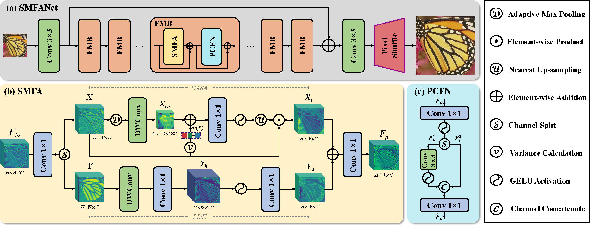

### 📖 SMFANet: A Lightweight Self-Modulation Feature Aggregation Network for Efficient Image Super-Resolution
<!-- > <a href="https://colab.research.google.com/drive/19DdsNFeOYR8om8QCCi9WWzr_WkWTLHZd?usp=sharing"></a>
[](https://openxlab.org.cn/apps/detail/Melokyyy/SAFMN)

[](https://github.com/sunny2109/SAFMN) <br>
> [[Paper](https://openaccess.thecvf.com/content/ICCV2023/papers/Sun_Spatially-Adaptive_Feature_Modulation_for_Efficient_Image_Super-Resolution_ICCV_2023_paper.pdf)] &emsp;
[[Supp](https://openaccess.thecvf.com/content/ICCV2023/supplemental/Sun_Spatially-Adaptive_Feature_Modulation_ICCV_2023_supplemental.pdf)]  &emsp;
[[Poster](https://github.com/sunny2109/SAFMN/blob/main/figs/poster_iccv23_SAFMN.pptx)] <br> -->

> [Mingjun Zheng](https://github.com/sunny2109), [Long Sun](https://github.com/sunny2109), [Jiangxin Dong](https://scholar.google.com/citations?user=ruebFVEAAAAJ&hl=zh-CN&oi=ao), and [Jinshan Pan](https://jspan.github.io/) <br>
> [IMAG Lab](https://imag-njust.net/), Nanjing University of Science and Technology


---
<p align="center">
  
</p>

***Network architecture of the proposed SMFANet**. The proposed s SMFANet consists of a shallow feature extraction module, feature modulation blocks, and a lightweight image reconstruction module. Feature modulation block contains one self-modulation feature aggregation (SMFA) module and one partial convolution-based feed-forward network (PCFN).*
 
---
### Requirements
> - Python 3.8, PyTorch >= 1.8
> - BasicSR 1.4.2
> - Platforms: Ubuntu 18.04, cuda-11

### Installation
```
# Clone the repo
git clone https://github.com/Zheng-MJ/SMFANet
# Install dependent packages
cd SMFANet
conda create --name smfan python=3.8
pip install -r requirements.txt
# Install BasicSR
python setup.py develop
```
You can also refer to this [INSTALL.md](https://github.com/XPixelGroup/BasicSR/blob/master/docs/INSTALL.md) for installation

### Training
Run the following commands for training:

```
# train SMFANet for x4 effieicnt SR
python basicsr/train.py -opt options/train/SMFANet/SMFANet_DIV2K_100w_x4SR.yml
# train SMFANet+ for x4 effieicnt SR
python basicsr/train.py -opt options/train/SMFANet/SMFANet_plus_DIV2K_100w_x4SR
```
### Testing 
- Download the testing dataset.
- The pretrained models are in './pretrain'.
- Run the following commands:
```
# test SMFANet for x4 efficient SR
python basicsr/test.py -opt options/test/SAFMN/test_benchmark_x4.yml
```
- The test results will be in './results'.

### TensorRT Optimization
- The code for TensorRT export is available at /to_tensorrt

### Visual Results
- **Download Visual Results** 
[Google Drive](https://drive.google.com/drive/folders/1xiPJq7WKe6-Lnoy7JkUxMeIXTOHs45le)  


 

### Experimental Results
- **Comparison with CNN-based lightweight SR methods**


- **Comparison with ViT-based lightweight SR methods**


- **Memory and running time comparisons on x4 SR**


- **Visual comparisons for x4 SR on the Urban100 dataset**


- **Comparison of local attribution maps (LAMs) and diffusion indices (DIs)**


 


<!-- 
### Citation
If this work is helpful for your research, please consider citing the following BibTeX entry.
```
@inproceedings{sun2023safmn,
    title={Spatially-Adaptive Feature Modulation for Efficient Image Super-Resolution},
    author={Sun, Long and Dong, Jiangxin and Tang, Jinhui and Pan, Jinshan},
    booktitle={Proceedings of the IEEE/CVF International Conference on Computer Vision},
    year={2023}
 }
 ``` -->


### Acknowledgement
This code is based on [BasicSR](https://github.com/XPixelGroup/BasicSR) toolbox. Thanks for the awesome work.

### Contact
If you have any questions, please feel free to reach me out at mingjunzheng@njust.edu.cn

